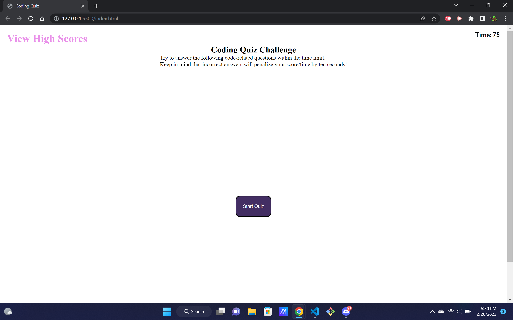

# javascript-quiz
a quiz ABOUT coding fundamentals USING javascript

This is a short, timed quiz that will test the users knowledge about coding. This was an absolute challenge to code, with balancing styling and javascript as well as trying to work in the high score board. Creating the timer was also difficult, and im honestly suprised that i even attempted to work with local storage for the high score board.

live site can be found at https://github.com/PhilRug/javascript-quiz